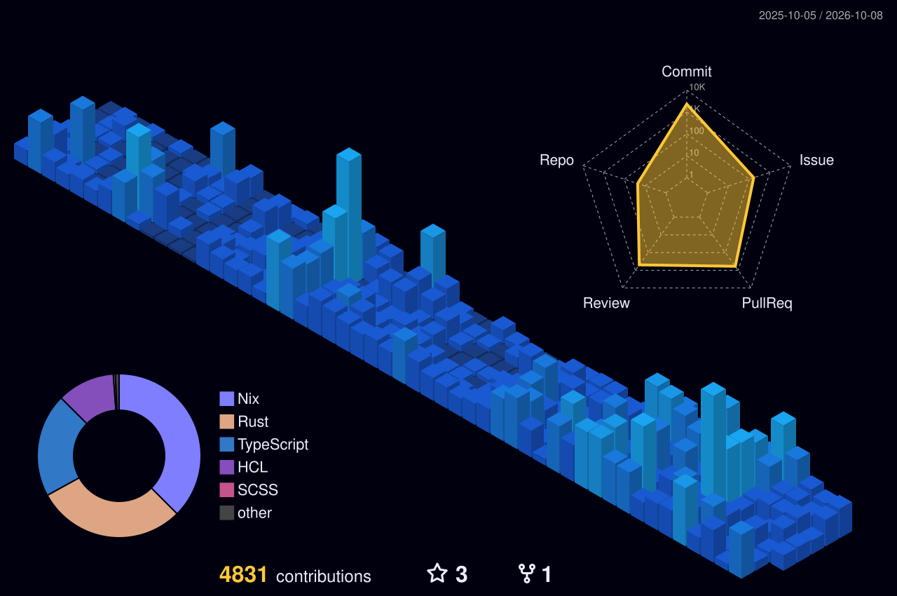

# Cloud & AI Systems Engineer

Autonomous agent infrastructure, resilient Kubernetes platforms, low-latency Rust systems.

Explore my interactive AI Agent Skills and Architecture Showcase:
[**skills.mahdtech.com**](https://skills.mahdtech.com)

[](https://skills.mahdtech.com)

## Daily AI Telemetry

- Telemetry: Active compute cycles concentrated on low-latency Rust systems and autonomous agent frameworks.
- Platform: Advancing Kubernetes platform deployments and infrastructure as code automation.
- Momentum: Continuous integration verification and automated profile compiler pipeline operational.
- Focus: Scaling multi-agent coordination tooling and resilient cloud-native workflows.

## Weekly Compute Cycles

```text
⚡ WEEKLY COMPUTE CYCLES (via WakaTime API)
━━━━━━━━━━━━━━━━━━━━━━━━━━━━━━━━━━━━━━━━━━━━━━━━━━━━━━━━
Markdown      45 hrs 47 mins  [████████░░░░░░░░░░░░] 40.4%
Rust          20 hrs 17 mins  [████░░░░░░░░░░░░░░░░] 17.9%
Python        17 hrs 33 mins  [███░░░░░░░░░░░░░░░░░] 15.5%
Nix           12 hrs 35 mins  [██░░░░░░░░░░░░░░░░░░] 11.1%
━━━━━━━━━━━━━━━━━━━━━━━━━━━━━━━━━━━━━━━━━━━━━━━━━━━━━━━━
OS: Linux | Primary Editor: Codex CLI
```

## Contribution Activity


## Certifications & Credentials

<a href="https://www.credly.com/badges/30c7981e-3626-4917-a19b-50492750187e"></a>
<a href="https://www.credly.com/badges/83d81826-c25e-4853-81eb-bcf626f82257"></a>
<a href="https://www.credly.com/badges/5d889a6a-6b1c-4484-83f6-4d43185f4d24"></a>
<a href="https://www.credly.com/badges/afa067be-977e-482c-913f-774f8f6892b0"></a>

## 3D Contribution Skyline



## Extended Recent Activity

- Contributed to [tars-cloud/actions](https://github.com/tars-cloud/actions): reusable CI workflows and tooling
- Developed [MAHDTech/MAHDTech](https://github.com/MAHDTech/MAHDTech): automated telemetry and profile compiler
- Contributed to [bingamon-lab-tf-modules/tf-ntnx-pc](https://github.com/bingamon-lab-tf-modules/tf-ntnx-pc): NTNX Prism Central Terraform modules
- Contributed to [bingamon-lab-tf-modules/tf-ntnx-ndb](https://github.com/bingamon-lab-tf-modules/tf-ntnx-ndb): NTNX Database Service automation

## Connect & Links

- Website: [mahdtech.com](https://www.mahdtech.com)
- GitHub: [github.com/MAHDTech](https://github.com/MAHDTech)
- Twitter: [@MAHDTecher](https://twitter.com/MAHDTecher)
- Stack Overflow: [MAHDTech](https://stackoverflow.com/users/10085799/mahdtech)

---

Last Updated: 2026-10-11 00:04 UTC | Built with [slop-cli](https://github.com/MAHDTech/MAHDTech) v0.1.1
